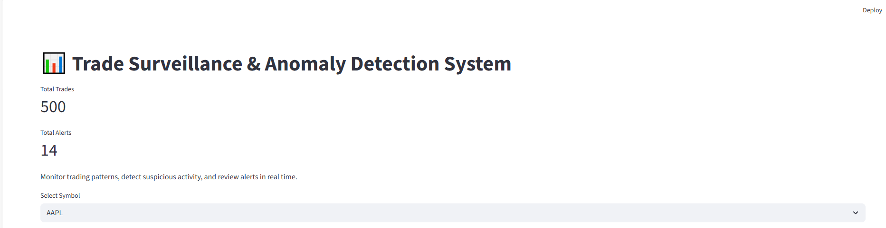
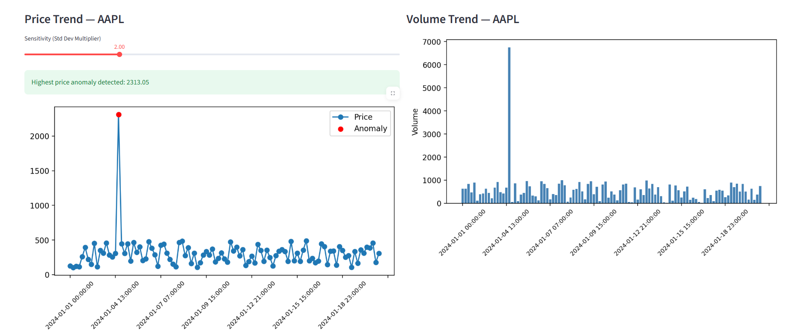
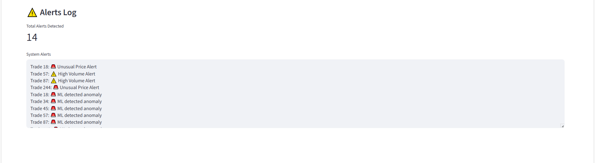

# 📊 Trade Surveillance & Anomaly Detection System

A real-time trade surveillance dashboard built using **Python**, **Streamlit**, and a **Machine Learning–ready architecture** to detect suspicious trading activity in financial markets.


## 🚀 Features

- Price anomaly detection (statistical threshold–based)
- Volume spike detection
- ML-based anomaly flagging
- Interactive Streamlit dashboard
- Sensitivity slider to tune anomaly detection
- Alert log with rule-based alerts
- Modular architecture (rules, ML, ingestion layers)

## 📊 Dashboard Preview

### 🔹 Overall Trade Surveillance Dashboard


### 🔹 Price & Volume Anomaly Detection


### 🔹 Alerts Log & System Alerts



## 🧠 Why this Project Matters

Trade surveillance is a critical function in investment banks and exchanges to detect:
- Market manipulation
- Unusual price or volume movements
- Suspicious trading patterns

This project simulates a real-world surveillance system used by financial institutions, combining **rule-based logic** with **ML extensibility**.


## ⚙️ How It Works

1. Trades are generated using synthetic market data
2. Price and volume patterns are continuously analyzed
3. Anomalies are detected using:
   - Standard deviation–based thresholds
   - Volume spike detection
   - ML anomaly scoring (extensible)
4. Alerts are generated and displayed in real time on the dashboard


## 🛠 Tech Stack

- Python
- Streamlit
- Pandas
- Matplotlib
- Scikit-learn
- Git & GitHub


## ▶️ How to Run Locally

```bash
git clone https://github.com/AnimeshSingh76/trade-surveillance-system.git
cd trade-surveillance-system
pip install -r requirements.txt
streamlit run streamlit_app.py


